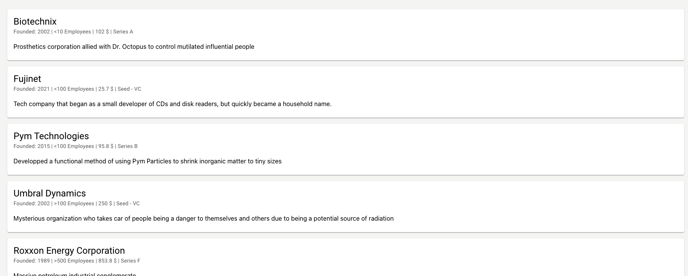

# 27Pilots Coding Challenge

Thank you for taking part in this coding challenge. For this challenge you will be given an unfinished React application, that you have to improve and enhance. The app will be recieving data to display from a Nodejs backend that you need to setup as well.

To be able to participate in the challenge you need to make sure to have all the pre-requisites in place:

- Nodejs v16.9+
- Npm v7.21+
- Docker
- Git
- IDE (e.g. VSCode)
- Github.com Account

If you have everything in place, first get the backend up and running and then setup the React frontend.

## Setup Nodejs Backend

To populate the frontend with some data a backend needs to be setup. Therefore the following steps have to be executed:

1. Pull the docker image `27pilots/coding-challenge-backend`
2. Run the image and bind the port `8000`

The console output should be something like this:

```
[Nest] 20  - 12/06/2021, 1:30:31 PM     LOG [RouterExplorer] Mapped {/api/startups, GET} route +12ms
[Nest] 20  - 12/06/2021, 1:30:31 PM     LOG [RouterExplorer] Mapped {/api/startups/:id, GET} route +1ms
[Nest] 20  - 12/06/2021, 1:30:31 PM     LOG [RoutesResolver] StartupUspController {/api/startup-usps}: +1ms
[Nest] 20  - 12/06/2021, 1:30:31 PM     LOG [RoutesResolver] StartupContactsController {/api/startup-contacts}: +0ms
[Nest] 20  - 12/06/2021, 1:30:31 PM     LOG [RouterExplorer] Mapped {/api/startup-contacts, GET} route +2ms
[Nest] 20  - 12/06/2021, 1:30:31 PM     LOG [NestApplication] Nest application successfully started +6ms
```

## Setup React Frontend

If you have not already done so, fork this repository to your github.com account. Then, clone the repository and install the dependencies with `npm`. Now launch the application with running the `npm start` script.

After successfully compiling you can access the app on http://localhost:3000.

## The Challenge

An important part of the application is to show a list of startups with some basic information. Please implement this startup list roughly according to the design. A list of startups can be retreived from the backend at this endpoint: `http:localhost:8000/api/startups`. The following steps will give you some guidance.

### Retreive Data

To retreive the startup list from the backend, extend the existing `src/Http/Startup.http.service.ts`, so that all the tests from `src/Http/Startup.http.service.test.ts` pass and a list of startups is returned from the service.

### Implement StartupList component

Now, extend the `StartupList` component so that it fetches the list of startups from `Startup.http.service.ts` and displays them like this:



### Check the Cypress tests

It might be that the design is already a little bit older, so make sure that your implementations complies to the existing Cypress test suite `cypress/integration/StartupList.spec.js`. You can run the tests with `npx cypress open` and then clicking on the test.

**Good luck & have fun!!**
